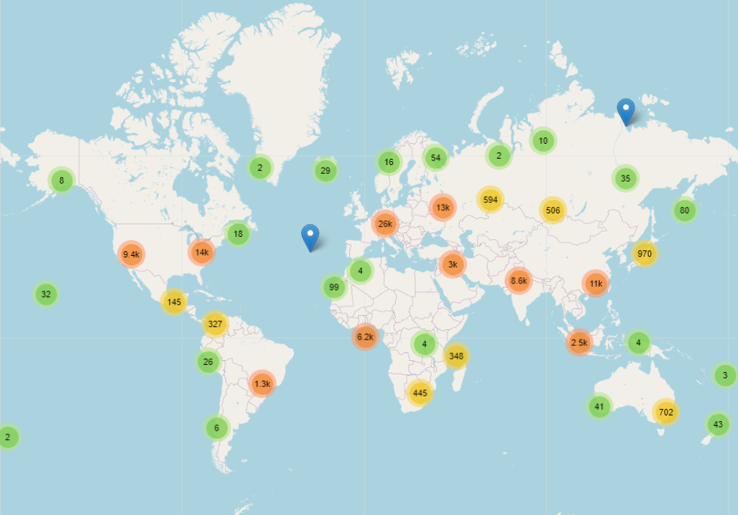

Blacked Ipsets' locations visualised in map

## Install

### Supercluster
In order to display million points clustered , supercluster api will be needed.Download the api. [Supercluster](https://github.com/mapbox/supercluster/).

### Geojson 
When installation is completed , a geojson file must be generated .
Download and run geojson_gen.ipynb in Jupyter(recommended) or geojson_gen.py .

Download [IP2LOCATION-LITE-DB5](https://www.ip2location.com/development-libraries/ip2location/python) and place it in same folder with py file.

Edit last lines path in order to save geojson file in "C:/Users/YourName/supercluster-master/test/fixtures.
There delete  places.json,places-z0-0-0.json.
This will be the new input value.

In /demo/worker.js edit your path to geojson method to find previous file generated.

In supercluster-master/demo find index.html.
Map will be shown there in the end.

In order to view map , supercluster folder must be hosted .

In my case i opened some ports via xampp and placed folder in C:\xampp\htdocs.

Visit localhost on any browser and navigate to demo.

